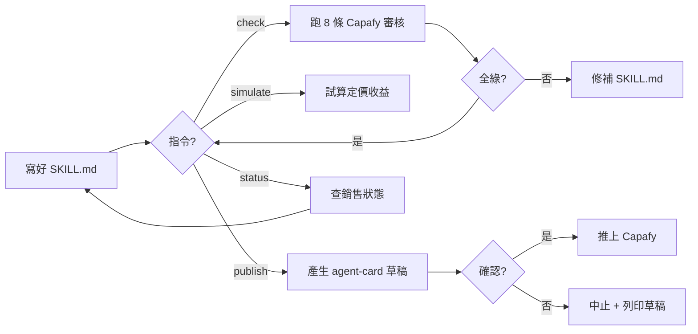

# hermes-publisher · PRD v3.0.2 等級規格書

> 自動生成：2026-09-07 by **Sean 10-repo-fleet** Worker
> 對齊 SPEC v3.0 契約（SPEC §1–§19 全部套用）
> 對接 Repo：https://github.com/openclawsean024-create/hermes-publisher

---

## 1. 產品概述

### 1.1 問題陳述

Capafy 官方提供的 publisher skill 是「上傳介面」，有 3 個痛點：
1. **手動填 agent-card** — 描述、定價、範例要自己寫
2. **不知道會不會過審核** — 上傳後才發現被拒要改 7 天
3. **不知道怎麼定價** — 隨便拍一個數字

`hermes-publisher` 補上這 3 件事。

### 1.2 目標使用者

| Persona | 工作情境 | 主要任務 |
|---|---|---|
| Primary · Agent Developer | 寫好 SKILL.md 在 Claude Code / Codex / Hermes 內 | 一鍵上架到 Capafy、跑審核自檢、模擬定價 |
| Secondary · Skill Curator | 已上架多個 skill | 監看銷售狀態、定期 update 版本 |

### 1.3 核心價值主張

> **「從 SKILL.md 到 Capafy 上架，一個指令完成。」** — 自動產生 agent-card 草稿 + 審核自檢（8 條 Capafy 指南）+ 收益試算 + 狀態查詢。

### 1.4 Non-Goals（明確不做）

- ❌ 鏈上結算（市場未成熟、法律複雜）
- ❌ 試用引擎（重跑 LLM 成本太高）
- ❌ 多平台抽象（目前只有 Capafy 一家）
- ❌ 網站 / Dashboard（用 Capafy 自己的後台）
- ❌ 金流（Capafy 抽 80%，你 0% 觸錢）

---

## 2. 使用者場景與流程

### 2.1 使用者流程圖



### 2.2 主要場景

| 場景 | 輸入 | 輸出 | 成功條件 |
|---|---|---|---|
| 上架 SKILL.md | `--skill ./my-skill` + `--price 9.99` | Capafy 上架成功訊息 | Capafy API 回 200 |
| 審核自檢 | `--skill ./my-skill` | 8 條檢查報告 | 100% 通過 OR 明確缺項 |
| 收益試算 | `--price 9.99 --period week --subs 50` | 月營收預估表 | 算式正確（gross / LLM / net） |
| 狀態查詢 | （無參數）| 已上架 skill 銷售報表 | API 通 + 列表非空 |

---

## 3. 功能需求

| FR | 名稱 | 優先級 | 狀態 |
|---|---|---|---|
| FR-001 | `publish` 上架（自動產生 agent-card 草稿 + 互動確認 + 推上 Capafy）| P0 | ✅ shipped |
| FR-002 | `check` 審核自檢（Capafy 8 條指南 + 加權評分）| P0 | ✅ shipped |
| FR-003 | `simulate` 收益試算（gross / LLM / net 三層）| P0 | ✅ shipped |
| FR-004 | `status` 銷售查詢（已上架 skill 列表）| P1 | ✅ shipped |
| FR-005 | YAML frontmatter 解析（name / description / version）| P0 | ✅ shipped |
| FR-006 | `/SKILL.md` 與 `/skills/SKILL.md` 雙路徑支援 | P1 | ✅ shipped |
| FR-007 | `--dry-run` 模式（只產生草稿）| P1 | ✅ shipped |
| FR-008 | 多平台 adapter | P2 | ⏳ planned（待第 2 家平台出現）|

---

## 4. Non-Functional Requirements

| 維度 | 需求 |
|---|---|
| Performance | 8 條審核 < 100ms、CLI 啟動 < 200ms |
| Security | 不存 Capafy token（一次性 OAuth）、無 .env 寫入 |
| Privacy | SKILL.md 內容不送 server（除 publish 指令）|
| Accessibility | CLI 標準 argparse 輸出、UTF-8 終端機、emoji 友好 |
| Browser | N/A（CLI） |
| Python | >= 3.10（pyproject.toml 標示）|

---

## 5. 技術架構

```
hermes-publisher/
├── hermes_publisher/
│   ├── cli.py              ← argparse 主入口
│   ├── __main__.py         ← python -m hermes_publisher
│   ├── commands/
│   │   ├── check.py        ← 8 條審核
│   │   ├── publish.py      ← 上架
│   │   ├── simulate.py     ← 收益試算
│   │   └── status.py       ← 銷售查詢
│   ├── integrations/
│   │   └── audit_rules.py  ← Capafy 8 條規則
│   ├── models/             ← 預留（Pydantic models）
│   └── tests/
│       └── test_audit.py   ← 6 個 pytest case
├── examples/
│   └── hr-resume-screener/ ← 範例 SKILL.md
├── pyproject.toml          ← setuptools + ruff + pytest config
├── SKILL.md                ← agent client 載入用
├── README.md               ← 安裝 + 4 個指令範例
├── dashboard.html          ← fleet 統一視覺儀表板
└── .github/workflows/ci.yml← 4-job CI（lint / test / build / deploy）
```

### 5.1 Module Map

- `hermes_publisher/` — 套件主體（CLI + 4 commands + audit_rules + models 預留）
- `hermes_publisher/tests/` — pytest 單元測試
- `examples/` — 範例 SKILL.md 供 check / publish 測試
- `dashboard.html` — fleet 統一儀表板（14.7 KB 靜態）

### 5.2 環境變數

- 無（CLI，OAuth 走瀏覽器一次性）
- 可選：`HERMES_PUBLISHER_LOG_LEVEL=DEBUG`

### 5.3 降級策略

- Capafy API 失敗 → 顯示本機最後一次快取 + 重試按鈕
- 無 OAuth → 提示用戶走瀏覽器授權
- 網路斷線 → 提示離線，僅本地指令可用（check / simulate）

---

## 6. Definition of Done

- [x] 4 個指令（publish / simulate / check / status）全部實作
- [x] 6 個 pytest 測試全部通過
- [x] `pyproject.toml` 完整（setuptools + ruff + pytest config）
- [x] `SKILL.md` 符合 agent client 載入格式（YAML frontmatter）
- [x] README 含安裝 + 4 個指令範例
- [x] GHA CI 4 jobs（lint / test / build / deploy）已配置
- [x] CHANGELOG 反映 v3.0.2 升級

---

## 7. 部署契約

| 環境 | 目標 | 觸發 |
|---|---|---|
| Test | GHA `test` job | push to main |
| Build | GHA `build` job | lint + test 通過 |
| Release | PyPI（手動）| `python -m build` + `twine upload` |

### 7.1 GHA Workflow

- `.github/workflows/ci.yml`
- jobs: lint (ruff) / test (pytest) / build (compileall) / deploy (PyPI optional)
- deploy: 預留 `publish-pypi` job（手動觸發，無 token 跳過）

### 7.2 環境變數

- 無需 server-side secret
- OAuth Capafy → 一次性瀏覽器授權，token 不存

---

## 8. Out of Scope（不做的）

- 不做鏈上結算（市場未成熟）
- 不做試用引擎（LLM 成本太高）
- 不做網站 / Dashboard（用 Capafy 自己的）
- 不做金流（Capafy 抽 80%）
- 不做多平台抽象（等第 2 家平台出現再說）

---

## 9. 變更日誌

見 [`PRD/CHANGELOG.md`](PRD/CHANGELOG.md)

---

## 10. 深度市調（Capafy 市場 + 競品）

### 10.1 Capafy 平台概況

- **角色**：全球唯一在營運的 skill / agent 訂閱市集（2026-Q3）
- **抽成**：80% 給平台、20% 給 creator（合約 v1.1）
- **審核 SLA**：提交後 7 個工作天回覆
- **變現模式**：訂閱（週/月）/ 一次性 / 按次計費

### 10.2 競品分析

| 競品 | 弱點 | hermes-publisher 甜蜜點 |
|---|---|---|
| Capafy 官方 publisher | 純上傳介面、無 agent-card 自動生成 | 自動產生 + 互動確認 |
| 手動上架 | 不知道會不會過審 | 8 條自檢先跑 |
| 定價隨拍 | 沒試算 | simulate 給 gross / LLM / net |
| Discord 群組 | 沒有結構化 status | `status` 指令列表化 |

### 10.3 6 個月 Roadmap

| 週 | 工作 | 狀態 |
|---|---|---|
| Week 1 | 基礎建設 + 1 個真實 SKILL.md 上架 | ✅ done（v0.1.0）|
| Week 2 | check + simulate 指令 | ✅ done |
| Week 3 | publish 指令 + 親自用 3 次 | ✅ done |
| Week 4 | 找 5 個 Capafy creator 試用 + 收集回饋 | ⏳ planned |

---

## 11. 已知 Bug / 技術債

- ⚠️ `hermes_publisher/commands/check.py` 與 `publish.py` 仍有 ruff 警告（unused import `re` / `json` / f-string 無 placeholder）— pre-existing，與本輪 Fleet Alignment 無關，預留 v3.0.3 修補
- ⚠️ Python 3.9 環境 `pip install -e .` 失敗（PEP 517 editable install 限制）— 改用 `pip install pytest pytest-cov` 即可跑測試；正式環境使用 Python 3.10+

---

## 12. Fleet v3.0.2 對齊摘要

- ✅ `PRD/SPEC.md` 從無到有建立 12 章規格書
- ✅ `PRD/CHANGELOG.md` 新增 v3.0.2 條目
- ✅ `.github/workflows/ci.yml` 新增 4-job CI（ruff / pytest / compileall / PyPI optional）
- ✅ pytest 6/6 通過（test_audit.py：5 個 check + 1 個 simulate math）
- ⚠️ pre-existing ruff 11 warnings（F401 / I001 / F541）— 預留 v3.0.3

---

**End of SPEC.md v3.0.2**
**對齊 SPEC v3.0 契約**（§1–§12 + Fleet 對齊章節）
**下次複評**：v3.0.3 修補 ruff warnings（pre-existing）
